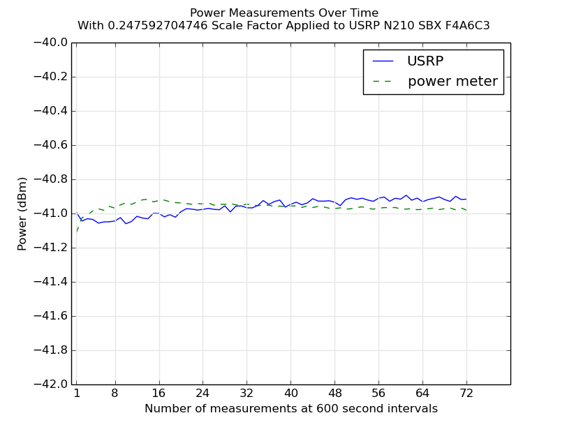

USRP Calibrator
===============

USRP Calibrator provides power calibration and other test utilities for USRP software defined radio using VISA-compatible test equipment.

Quick Start
-----------

1. Install GNU Radio and UHD (recommend using [PyBombs](https://github.com/pybombs/pybombs))
2. Don't forget to `./pybombs env` and then `source setup_env.sh`
3. `sudo apt-get install python-numpy python-matplotlib python-pip`
4. `sudo pip install pyvisa-py`
5. Setup equipment simliar to the following block diagram

6. Copy and modify a `test_profile/*.profile` to your needs.
**WARNING:** Notice there is a 30dB attenuator after the signal generator in the block diagram. If you don't have an attenuator make sure to adjust the `siggen_amplitude` and set `siggen_amplitude_check = True` so that USRP Calibrator will refuse to burn out the front end of your USRP!
7. `./usrp_power_cal.py test_profiles/your.profile`
8. The calibration utilty provides a *voltage* scale factor suitable for usage input to, e.g., GNU Radio's `multiply_const_cc` block.

Example Usage
-------------

```bash
$ ./usrp_power_cal.py test_profiles/usrp_n210_sbx.profile 
linux; GNU C++ version 4.8.4; Boost_105400; UHD_003.010.git-101-g4a1cb1f2

Using following profile:
{'nmeasurements': 72,
 'nsamples': 1000,
 'nskip': 1000000,
 'powermeter_scpi_measure_cmd': 'MEAS1:POW:AC? -10DBM,2,(@1)',
 'powermeter_visa_connect_str': 'TCPIP0::192.168.***.***::INSTR',
 'scale_factor': 1,
 'siggen_amplitude': -10,
 'siggen_amplitude_check': False,
 'siggen_center_freq': 1700000000.0,
 'siggen_scpi_rf_off_cmd': ':OUTPut:STATe OFF',
 'siggen_scpi_rf_on_cmd': ':OUTPut:STATe ON',
 'siggen_visa_connect_str': 'TCPIP0::192.168.***.***::5025::INSTR',
 'switchdriver_scpi_select_meter_cmd': 'ROUTe:OPEn (@109)',
 'switchdriver_scpi_select_radio_cmd': 'ROUTe:CLOSe (@109)',
 'switchdriver_visa_connect_str': 'TCPIP0::192.168.***.***::INSTR',
 'time_between_measurements': 300,
 'usrp_center_freq': 1700000000.0,
 'usrp_clock_rate': 100000000.0,
 'usrp_device_name': None,
 'usrp_device_str': 'USRP N210 SBX',
 'usrp_device_type': 'usrp2',
 'usrp_gain': {'PGA0': 15},
 'usrp_ip_address': '192.168.***.***',
 'usrp_lo_offset': 1000000.0,
 'usrp_sample_rate': 2000000.0,
 'usrp_serial': *******,
 'usrp_stream_args': 'fc32',
 'usrp_use_integerN_tuning': False}

Initializing USRP
Found the following USRP matching test profile criteria:

Device Address:
    type: usrp2
    addr: 192.168.***.***
    name: 
    serial: *******

-- Opening a USRP2/N-Series device...
-- Current recv frame size: 1472 bytes
-- Current send frame size: 1472 bytes
Tune Result:
    Target RF  Freq: 1701.000000 (MHz)
    Actual RF  Freq: 1701.001221 (MHz)
    Target DSP Freq: 1.001221 (MHz)
    Actual DSP Freq: 1.001221 (MHz)

Initializing power meter
Initializing signal generator
Initializing switch
Signal generator RF ON
-----

Starting test 1 at 1450905358
Switching to power meter
Taking power meter measurement... -41.4017074 dBm
Switching to USRP
Streaming samples from USRP... received 1000 samples with mean power of -29.133253817 dB
Sleeping 293 s until next test...
-----

Starting test 2 at 1450905658
Switching to power meter
Taking power meter measurement... -41.4034744 dBm
Switching to USRP
Streaming samples from USRP... received 1000 samples with mean power of -29.2450711456 dB
Sleeping 293 s until next test...
-----

[...]

-----

Starting test 72 at 1450926664
Switching to power meter
Taking power meter measurement... -41.2345738 dBm
Switching to USRP
Streaming samples from USRP... received 1000 samples with mean power of -29.2711198499 dB
-----


Computed scale factor: 0.252082747034

Plotting...

Calibration completed successfully, exiting...
```




